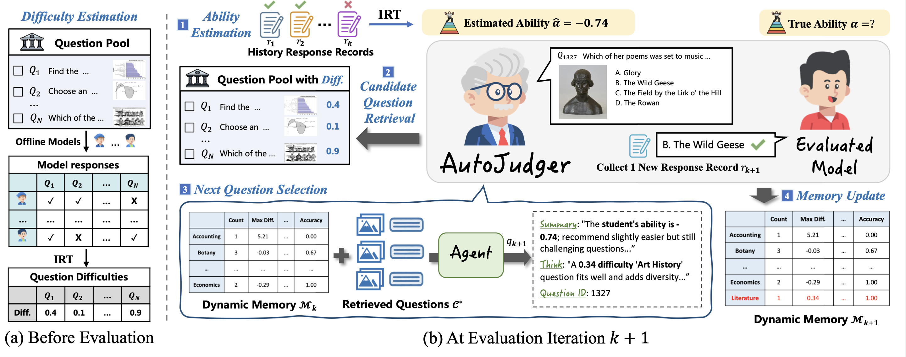

<div align="center">
  <h1 style="display: inline-block; font-size: 32px;">
  <p align="center">
    
    AutoJudger: An Agent-Driven Framework for Efficient Benchmarking of MLLMs
  <p>
  </h1>
</div>
<p align="center"><strong>Xuanwen Ding<sup>1,3*</sup> , Chengjun Pan<sup>1*</sup>  , Zejun Li<sup>1*</sup>  , Jiwen Zhang<sup>1*</sup>  ,<br /> Siyuan Wang<sup>2</sup>  ,  Zhongyu Wei<sup>1,3†</sup>.</strong></p>
<p align="center">
  <sup>1</sup>Fudan University, Shanghai China <br />
  <sup>2</sup>University of Southern California, Los Angeles, USA <br />
  <sup>3</sup>Shanghai Innovation Institute, Shanghai, China
</p>
<p align="center">
  * Equal Contribution,  † Corresponding Author
</p>
<p align="center">
    <a href="https://arxiv.org/abs/2505.21389"></a>
    
</p>

## 📝 Introduction

<p align="center">
  
</p>

**AutoJudger** is an agent-driven framework for efficient and adaptive benchmarking of MLLMs that tackles this escalating cost. AutoJudger employs the Item Response Theory (IRT) to estimate the question difficulty and an autonomous evaluation agent to dynamically select the most informative test questions based on the model’s real-time performance. Specifically, AutoJudger incorporates two pivotal components: a semantic-aware retrieval mechanism to ensure that selected questions cover diverse and challenging scenarios across both vision and language modalities, and a dynamic memory that maintains contextual statistics of previously evaluated questions to guide coherent and globally informed question selection throughout the evaluation process.Extensive experiments on four representative multimodal benchmarks demonstrate that our adaptive framework dramatically reduces evaluation expenses, i.e. AutoJudger uses only 4% of the data to achieve over 90% ranking accuracy with the full benchmark evaluation on MMT-Bench. 

---

## 🛠️ Getting Started

### Directory Structure
```
AutoJudger/
├── models/                  # Judging agent model weights
├── data/                    # Processed benchmark info (splits, difficulty scores)
│   └── SEEDBench_IMG/       # Example: SEEDBench-specific data
├── VLMEvalKit               # Model evaluation tool
├── LMUData/                 # Raw benchmark files (i.e. tsv)
├── model_performance/       # Model evaluation records
├── clip_features/           # CLIP embeddings for all questions
│   └── clip_models/         # Downloaded clip model weights
├── init/                    # Initial 10 seed questions (CLIP-based clustering)
├── out_folder/              # Output results
```


### 📦 Install
Git clone our repository, via the following command:
```bash
git clone git@github.com:IMNearth/AutoJudger.git
cd AutoJudger
conda create -n autojudger python=3.11
pip install -r requirements.txt
```

### 🔗 Prepare Data

#### 1. Install VLMEvalKit
Install [VLMEvalKit](https://github.com/open-compass/VLMEvalKit) by following the instructions provided by [QuickStart](https://github.com/open-compass/VLMEvalKit/blob/main/docs/en/Quickstart.md). 
```bash
git clone https://github.com/open-compass/VLMEvalKit.git
cd VLMEvalKit
pip install -e .
```

#### 2. Download Benchmark
Download the original benchmark files (i.e. raw TSV files with questions, images, options, answers) and place them in the `LMUData/` directory:
* [SEEDBench_IMG.tsv](https://opencompass.openxlab.space/utils/benchmarks/SEEDBench/SEEDBench_IMG.tsv) → `LMUData/SEEDBench_IMG.tsv`
* [AI2D_TEST.tsv](https://opencompass.openxlab.space/utils/VLMEval/AI2D_TEST.tsv) → `LMUData/AI2D_TEST.tsv`
* [MMMU_DEV_VAL.tsv](https://opencompass.openxlab.space/utils/VLMEval/MMMU_DEV_VAL.tsv) → `LMUData/MMMU_DEV_VAL.tsv`
* [MMT-Bench_VAL.tsv](https://opencompass.openxlab.space/utils/benchmarks/MMT-Bench/MMT-Bench_VAL.tsv) → `LMUData/MMT-Bench_VAL.tsv`

#### 3. Collect Model Responses
Collect the model response records on these benchmarks and put them in the `model_performance/`.
* We thank the [VLMEvalKit](https://github.com/open-compass/VLMEvalKit) for providing such a convenient tool to collect these records. 
* Here is a example about how to collect model responses on `SEEDBench_IMG`:
```bash
cd VLMEvalKit
torchrun --nproc-per-node=4 run.py --data SEEDBench_IMG --model GPT4o Qwen2.5-VL-7B-Instruct --verbose
```
  
#### 4. Estimate Question Difficulty
Generate IRT-estimated difficulty scores for each question by running `prepare_dataset.py`. The results will be placed in the `data/` folder. 

Besides, under this folder, there also exists
* Model list and benchmark metadata (`data/model_information_new.csv`)
* Train/test splits (`data/test_model_list.json`)

#### 5. Generate Question Embeddings
Generate CLIP embeddings for the evaluation benchmark by using the following command:
```bash
cd ./clip_features
python clip.py --benchmark AI2D_TEST --mode multimodal --fusion_method concat --save_dir ./ --download_root ./clip_models
```
This script generates embeddings (text, image, or multimodal) using the CLIP model. It supports flexible processing modes and fusion methods for combining text and image embeddings. Here is the explanations for the **arguments**:
- `--benchmark (str)`: Set the benchmark name that are supported in VLMEvalKit.
- `--mode (str, default to 'multimodal', choices are ['text', 'image', 'multimodal'])`: When `mode` set to "multimodal", both text and image embeddings are used to construct the feature for questions.
- `--fusion_method (str, default to 'concat', choices are ['mean', 'sum', 'concat'])`: When `fusion_method` set to "concat", we use the concated embeddings from text and image as the question feature.
- `--download_root (str)`: Where to save the clip models, the models will be automatically downloaded by calling `clip.load(...)`.
- `--save_dir (str)`: Where to save the processed embeddings for questions. 


### 📒 Download Model Weights
Download `Qwen2.5-VL-7B-Instruct`, via the following command:
```bash
mkdir models
cd ./models
git clone https://huggingface.co/Qwen/Qwen2.5-VL-7B-Instruct
```

### 🚀 Run
To launch an adaptive evaluation:
```bash
python main.py \
  --model_name Qwen2.5-VL-7B-Instruct \
  --benchmark SEEDBench_IMG \
  --feature text

# Parameters:
# --feature: Feature type [text|image|multimean|multiconcat]
# --benchmark: benchmark name
```

## 📊 Citation
If AutoJudger has been beneficial to your research and work, please cite our work using the following format:
```bibtex
@misc{ding2025autojudgeragentdrivenframeworkefficient,
      title={AutoJudger: An Agent-Driven Framework for Efficient Benchmarking of MLLMs}, 
      author={Xuanwen Ding and Chengjun Pan and Zejun Li and Jiwen Zhang and Siyuan Wang and Zhongyu Wei},
      year={2025},
      eprint={2505.21389},
      archivePrefix={arXiv},
      primaryClass={cs.CL},
      url={https://arxiv.org/abs/2505.21389}, 
}
```

